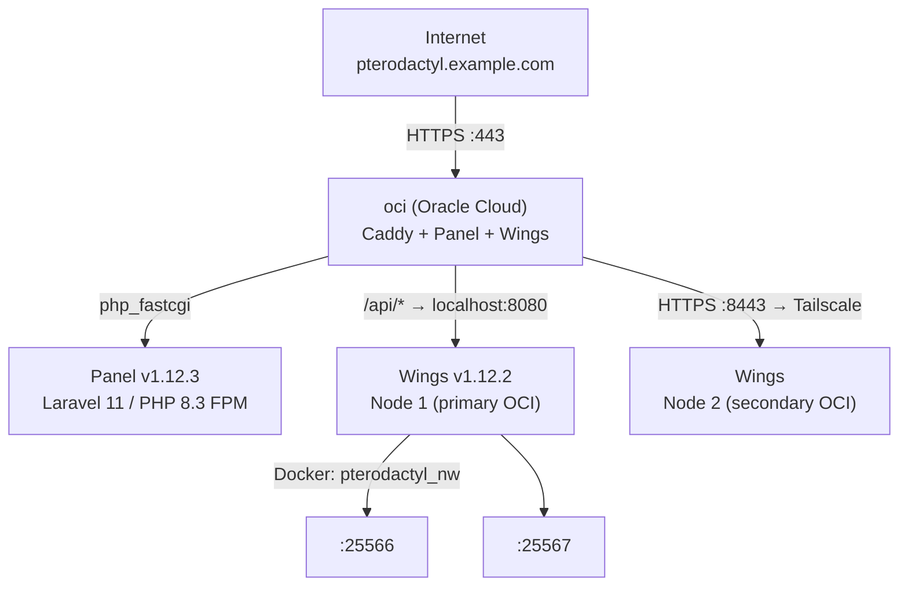

# Pterodactyl

Game server management panel for Minecraft servers. Runs on the **oci** instance (Oracle Cloud) — not on bigmt and not managed by Komodo (which only manages bigmt). Both the **Panel** (web UI) and **Wings** (daemon that spawns game server containers) are installed natively via systemd.

## Architecture



- **Panel** — Laravel web app served directly by Caddy (no separate web server container)
- **Wings** — Go daemon that manages the game server lifecycle via Docker
- The panel and Wings on node 1 both live on the same host (oci); node 2 is a separate host reached over Tailscale

## Components

### Panel (v1.12.3)

| Setting      | Value                                |
| ------------ | ------------------------------------ |
| Install dir  | `/var/www/pterodactyl`               |
| Framework    | Laravel 11                           |
| PHP          | 8.3 (FPM, `php8.3-fpm.sock`)         |
| Database     | MariaDB 10.11 on `127.0.0.1` (`panel`) |
| Queue worker | `pteroq.service` (artisan queue:work) |
| Timezone     | Europe/Stockholm                     |
| URL          | `https://pterodactyl.example.com`    |

### Wings (v1.12.2)

| Setting       | Value                                  |
| ------------- | -------------------------------------- |
| Binary        | `/usr/local/bin/wings`                 |
| Config        | `/etc/pterodactyl/config.yml`          |
| Service       | `wings.service` (systemd, runs as root) |
| API           | `0.0.0.0:8080`                         |
| SFTP          | `0.0.0.0:2022`                         |
| Data root     | `/var/lib/pterodactyl/volumes`         |
| Logs          | `/var/log/pterodactyl`                 |
| Docker network| `pterodactyl_nw` (`172.18.0.0/16`, DNS 1.1.1.1) |

### Reverse proxy (Caddy on oci)

```caddy
pterodactyl.example.com {
    @wings path /api/servers /api/servers/* /api/system /api/system/* \
            /api/transfers /api/transfers/* /api/update /api/update/* \
            /upload/* /download/*
    handle @wings {
        reverse_proxy localhost:8080
    }
    handle {
        root * /var/www/pterodactyl/public
        php_fastcgi unix//run/php/php8.3-fpm.sock
        file_server
    }
}

pterodactyl.example.com:8443 {
    reverse_proxy https://<NODE2_TAILSCALE_HOSTNAME>:8080 {
        transport http {
            tls_server_name <NODE2_TAILSCALE_HOSTNAME>
        }
    }
}
```

- Normal panel requests are served directly from `/var/www/pterodactyl/public` via PHP-FPM
- Wings API paths (`/api/*`, `/upload/*`, `/download/*`) are proxied to `localhost:8080`
- Port `:8443` forwards to node 2's Wings API over Tailscale

## Nodes

| Node | Name         | RAM    | Disk   | Wings API   | SFTP |
| ---- | ------------ | ------ | ------ | ----------- | ---- |
| 1    | primary OCI   | 16 GB  | 100 GB | `:443` (via Caddy) | 2022 |
| 2    | secondary OCI | 16 GB  | 40 GB  | `:8443` (via Caddy) | 2022 |

Node 1 runs on oci itself; node 2 runs on a separate host (`<NODE2_HOSTNAME>`) reached over Tailscale. The `<SERVER_5>` Paper server is attached to node 2 and is currently stopped.

## Game Servers

| Server       | Egg   | Image                  | Port           | RAM        | Status  |
| ------------ | ----- | ---------------------- | -------------- | ---------- | ------- |
| `<SERVER_1>` | Forge | `yolks:java_8`         | 25565 TCP/UDP  | unlimited  | stopped |
| `<SERVER_2>` | Forge | `yolks:java_8`         | 25566 TCP/UDP  | unlimited  | running |
| `<SERVER_3>` | Fabric| `yolks:java_21`        | 25567 TCP/UDP  | 8 GB       | running |
| `<SERVER_4>` | Forge | `yolks:java_17`        | 25568 TCP/UDP  | unlimited  | stopped |
| `<SERVER_5>` | Paper | `yolks:java_25`        | 25565 TCP/UDP  | unlimited  | stopped (node 2) |

Forge servers run with `SERVER_MEMORY=0` (no limit) using `-XX:MaxRAMPercentage=95.0` and `unix_args.txt`; the Fabric server (`<SERVER_3>`) is capped at 8000 MB.

## Ports & Firewall

In addition to the base rules (22, 80, 443, 41641/UDP), UFW on oci allows:

| Port          | Protocol | Purpose                 |
| ------------- | -------- | ----------------------- |
| 2022          | TCP      | Wings SFTP              |
| 25565:25575   | TCP/UDP  | Game server ports       |
| 8443          | TCP      | Wings API (node 2)      |

## Management

```bash
# Wings daemon
ssh oci "sudo systemctl status wings"
ssh oci "sudo systemctl restart wings"

# Panel queue worker
ssh oci "sudo systemctl restart pteroq"

# Panel cache / config cache
sudo -u pterodactyl php /var/www/pterodactyl/artisan config:cache

# Wings binary update
sudo /usr/local/bin/wings configure
```

> The Wings config (`/etc/pterodactyl/config.yml`) contains the daemon token used to authenticate with the panel — do not commit it.
