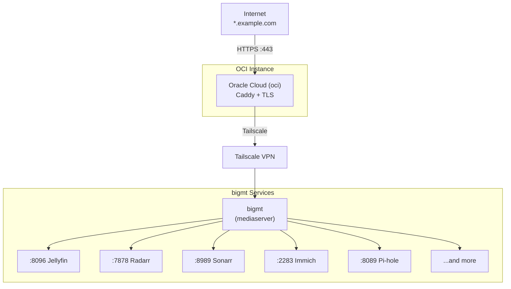
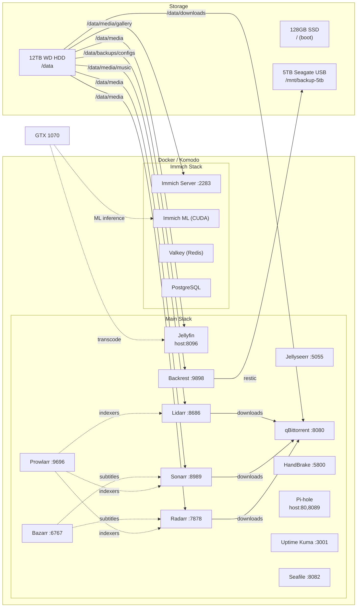

# bigmt-mediaserver

Self-hosted mediaserver running on **bigmt**, managed with Docker and Komodo.

## Architecture

### Network / Reverse Proxy Flow



### Service Architecture on bigmt



- **bigmt** — main server running all services via Docker, deployed by Komodo (git is the source of truth)
- **Oracle Cloud (oci)** — reverse proxy running Caddy, connected to bigmt over Tailscale
- **DNS** — `*.example.com` points to Oracle Cloud public IP; Caddy handles TLS and proxies to bigmt via Tailscale hostname `<TAILSCALE_HOSTNAME>`

## Hardware

| Component         | Spec                                           |
| ----------------- | ---------------------------------------------- |
| **CPU**           | Intel Core i5-7400 @ 3.00GHz (4C/4T)           |
| **RAM**           | 16 GB                                          |
| **GPU**           | NVIDIA GeForce GTX 1070 (8 GB)                 |
| **Boot disk**     | SanDisk 128 GB SSD (`/`)                       |
| **Data disk**     | WD 12 TB HDD (`/data`)                         |
| **Backup disk**   | Seagate 5 TB Expansion (`/mnt/backup-5tb`)     |
| **Backup disk 2** | 1 TB (not always connected, `/mnt/backup-1tb`) |

## Services

### Main Stack (`stacks/docker-compose.yml`)

| Service         | Description                | Port                 |
| --------------- | -------------------------- | -------------------- |
| **Jellyfin**    | Media server               | host mode (8096)     |
| **Radarr**      | Movie management           | 7878                 |
| **Sonarr**      | TV show management         | 8989                 |
| **Bazarr**      | Subtitle management        | 6767                 |
| **Jellyseerr**  | Media request management   | 5055                 |
| **Prowlarr**    | Indexer management         | 9696                 |
| **qBittorrent** | Torrent client             | 8080                 |
| **HandBrake**   | Video transcoding (web UI) | 5800                 |

These eight are one Komodo stack, which is to say one compose project (`mediastack`). They stay together because they are the only group that still interacts — and they reach each other over published host ports, not compose service DNS, which is what makes the project splittable at all.

### Infrastructure Stack (`stacks/infrastructure.yml`)

| Service         | Description                    | Port                 |
| --------------- | ------------------------------ | -------------------- |
| **Pi-hole**     | DNS ad blocker                 | host mode (80, 8089) |
| **Uptime Kuma** | Status monitoring              | 3001                 |
| **Scrutiny**    | Disk S.M.A.R.T. monitoring     | 8079                 |

Kept out of `mediastack` on purpose: Pi-hole going down kills LAN DNS *including for whatever is being deployed*, and losing monitoring at the same time as what it monitors hides the breakage.

### Backrest Stack (`stacks/backrest.yml`)

| Service      | Description                | Port  |
| ------------ | -------------------------- | ----- |
| **Backrest** | Backup management (restic) | 9898  |

Its own project with `restart: "no"`, and its start is gated on the backup drive actually being mounted by `backrest-guard.service` — see the header in `stacks/backrest.yml` for why that check has to live on the host.

### Seafile Stack (`stacks/seafile.yml`)

| Service              | Description              | Port                 |
| -------------------- | ------------------------ | -------------------- |
| **Seafile**          | File sync & share        | 8082                 |
| **Seafile MariaDB**  | Database                 | internal             |
| **Seafile Memcached** | Cache                  | internal             |

Split out of the main stack as its own compose project: nothing outside the trio talks to it over compose service DNS, and the floating `seafileltd/seafile-mc:latest` tag should not be able to take the `*arr` chain down with it. The three must stay together — they are coupled by name (`DB_HOST=seafile-mysql`, the `memcached` alias). When cutting over, deploy the main stack first so its `--remove-orphans` reaps the old containers; a new project cannot start while same-named containers exist.

### Homepage Stack (`stacks/homepage.yml`)

| Service      | Description                                   | Port                 |
| ------------ | --------------------------------------------- | -------------------- |
| **Homepage** | Dashboard: app links + widgets + metrics      | 3000                 |
| **Glances**  | System metrics backend (CPU/GPU/RAM/disk/net) | host mode (61208)    |

### Immich Stack (`stacks/immich.yml`)

| Service            | Description                      | Port     |
| ------------------ | -------------------------------- | -------- |
| **Immich Server**  | Photo/video management           | 2283     |
| **Immich ML**      | Machine learning (CUDA)          | internal |
| **Redis (Valkey)** | Cache                            | internal |
| **PostgreSQL**     | Database (vectorchord+pgvectors) | internal |

## Service Dependency Map

What breaks when a component goes down:

| Component down | Impact |
|----------------|--------|
| **Caddy (oci)** | All remote/public access lost. Local network access (by IP/port) still works. |
| **Tailscale** | Caddy can't reach bigmt — same as Caddy down for remote access. SSH only via local network. |
| **Pi-hole** | DNS resolution fails for all LAN clients. Services themselves keep running but clients can't resolve hostnames. Switch clients to `1.1.1.1` as workaround. |
| **Docker engine** | All containerized services down. Cockpit (native) still accessible on `:9090`. |
| **Komodo Core** | No UI, no deploys, no alerts. **Running containers are unaffected** — Periphery is a separate systemd service and Docker restart policies keep everything up. Use the `docker` CLI as fallback. |
| **Prowlarr** | Radarr/Sonarr can't search indexers for new content. Existing downloads and libraries unaffected. |
| **Radarr** | No new movie grabs. Jellyfin movie library still works (read-only). |
| **Sonarr** | No new episode grabs. Jellyfin show library still works (read-only). |
| **Lidarr** | No new music grabs. Jellyfin music library still works (read-only). |
| **Bazarr** | No automatic subtitle downloads. Existing subtitles unaffected. |
| **qBittorrent** | All active downloads stop. Radarr/Sonarr can't send new downloads. Completed media unaffected. |
| **Jellyfin** | No media playback. All *arr services and downloads continue working independently. |
| **Jellyseerr** | No media request UI. Radarr/Sonarr still process existing items. |
| **Backrest** | No backups run (manual or scheduled). Data integrity at risk until restored. |
| **Immich** | Photo/video library inaccessible. ML processing stops. PostgreSQL data preserved on disk. |
| **Immich PostgreSQL** | Immich server fully non-functional (all data in DB). Requires DB restore from backup. |
| **Seafile** | File sync inaccessible. Seafile MariaDB data preserved on disk. |
| **Seafile MariaDB** | Seafile fully non-functional. Requires DB restore from backup. |
| **Uptime Kuma** | No monitoring or Discord alerts. All services continue running unmonitored. |
| **GTX 1070 / NVIDIA driver** | Jellyfin falls back to software transcoding (very slow). Immich ML falls back to CPU. |
| **Data drive (`/data`)** | **Total loss** — all media, configs, containers gone. Requires full disaster recovery from backup drive. |
| **Backup drive** | No backups possible. Production unaffected. Replace drive ASAP. |

### Critical path

```
Internet → Caddy (oci) → Tailscale → bigmt (Docker) → individual services
```

Single points of failure: Caddy, Tailscale, the data drive, Docker engine. All remote access flows through the OCI→Tailscale→bigmt chain.

## Reverse Proxy

Caddy runs on the Oracle Cloud instance (`proxy/Caddyfile`). All subdomains under `*.example.com` are proxied through Tailscale to bigmt:

| Subdomain                        | Backend             |
| -------------------------------- | ------------------- |
| `jellyfin.*`                     | Jellyfin (:8096)    |
| `sonarr.*`                       | Sonarr (:8989)      |
| `radarr.*`                       | Radarr (:7878)      |
| `bazarr.*`                       | Bazarr (:6767)      |
| `lidarr.*`                       | Lidarr (:8686)      |
| `jellyseerr.*`                   | Jellyseerr (:5055)  |
| `prowlarr.*`                     | Prowlarr (:9696)    |
| `qbittorrent.*`                  | qBittorrent (:8080) |
| `komodo.*`                       | Komodo Core (:9120, Tailscale only) |
| `cockpit.*`                      | Cockpit (:9090)     |
| `immich.*`                       | Immich (:2283)      |
| `pihole.*`                       | Pi-hole (:80)       |
| `backrest.*`                     | Backrest (:9898)    |
| `uptime.*`                       | Uptime Kuma (:3001) |
| `scrutiny.*`                     | Scrutiny (:8079) |
| `seafile.*`                       | Seafile (:8082)     |
| `seraphine.*`                     | Vocard Dashboard (:8050) |
| `bigmt.example.com`              | Homepage (:3000)    |
| `pterodactyl.*`                   | Pterodactyl panel + Wings API (served by Caddy on oci, not via Tailscale) |

Caddy auto-provisions TLS certificates via Let's Encrypt.

## Oracle Cloud (oci)

The reverse proxy runs on an Oracle Cloud free-tier instance.

| Component     | Detail             |
| ------------- | ------------------ |
| **OS**        | Ubuntu 24.04 LTS   |
| **Kernel**    | 6.17.0-1010-oracle |
| **Caddy**     | v2.11.2            |
| **Tailscale** | 1.96.4             |

**UFW firewall rules:**

| Port  | Protocol | Purpose                      |
| ----- | -------- | ---------------------------- |
| 22    | TCP      | SSH                          |
| 80    | TCP      | HTTP (Caddy / Let's Encrypt) |
| 443   | TCP      | HTTPS (Caddy)                |
| 2022  | TCP      | Pterodactyl Wings SFTP       |
| 25565-25575 | TCP/UDP | Minecraft game server ports (Pterodactyl) |
| 8443  | TCP      | Pterodactyl Wings API (node 2) |
| 41641 | UDP      | Tailscale direct connections |

All other incoming traffic is denied by default.

## Pterodactyl

Game server panel for Minecraft servers, running on oci (not bigmt). See [PTERODACTYL.md](PTERODACTYL.md) for the full setup — nodes, game servers, ports, and management commands.

## Pi-hole

Pi-hole runs in host mode on bigmt, providing DNS-level ad blocking for the local network.

- **Upstream DNS**: Cloudflare (`1.1.1.1`), Google (`8.8.8.8`)
- **Web UI port**: 8089
- **Listening mode**: LOCAL (local subnets only)
- **CNAME deep inspection**: enabled
- **ESNI blocking**: enabled
- **DNSSEC**: disabled
- **Block TTL**: 2 seconds

### Adlists

| List | Description |
|------|-------------|
| [StevenBlack/hosts](https://raw.githubusercontent.com/StevenBlack/hosts/master/hosts) | Default unified hosts (migrated from initial setup) |
| [nordic-dns-blocklist](https://raw.githubusercontent.com/PaulSorensen/nordic-dns-blocklist/main/hosts) | Nordic region DNS blocklist |

### Non-default settings

Only `dns.upstreams`, `webserver.api.pwhash`, and `files.macvendor` are changed from defaults. Everything else (DHCP, local DNS records, groups, etc.) is at default.

## Uptime Kuma

Uptime Kuma monitors all services via their public reverse-proxied URLs. All monitors use HTTP checks with 1-hour intervals, expecting `200-299` status codes.

| Monitor | URL |
|---------|-----|
| Jellyfin | `https://jellyfin.example.com` |
| Sonarr | `https://sonarr.example.com/api/v3/health` |
| Radarr | `https://radarr.example.com` |
| Jellyseerr | `https://jellyseerr.example.com` |
| Bazarr | `https://bazarr.example.com/api/system/health` |
| Prowlarr | `https://prowlarr.example.com` |
| qBittorrent | `https://qbittorrent.example.com` |
| Immich | `https://immich.example.com` |
| Pi-hole | `https://pihole.example.com/admin` |
| Komodo | `https://komodo.example.com` (Tailscale only — Caddy `private_only`) |
| Cockpit | `https://cockpit.example.com` |

**Notifications**: Discord webhook (channel: "Kuma webhook")

## Media Library

```
/data/media/
├── movies/      # Radarr-managed
├── shows/       # Sonarr-managed
├── music/       # Lidarr-managed
├── gallery/     # Immich uploads (photos/videos)
├── recorded/    # Manually recorded content (Finnish TV, etc.)
└── trash/       # Recycle bin
```

## Radarr / Sonarr Configuration

### Root Folders

| Service | Root Folder          |
| ------- | -------------------- |
| Radarr  | `/data/media/movies` |
| Sonarr  | `/data/media/shows`  |

### Download Client

Both use **qBittorrent** (connects to `localhost:8080` within the Docker network).

### Quality Profiles

**Radarr:**

Prefer 1080p for small capacity and satisfactory quality paired with Nvidia Shield upscaling.

| Profile         | Cutoff       | Upgrades |
| --------------- | ------------ | -------- |
| Any             | Bluray-1080p | No       |
| SD              | Bluray-1080p | No       |
| HD-720p         | Bluray-720p  | No       |
| HD-1080p        | Bluray-1080p | No       |
| Ultra-HD        | Remux-2160p  | No       |
| HD - 720p/1080p | Bluray-720p  | No       |

**Sonarr:**

| Profile | Cutoff | Upgrades |
| ------- | ------ | -------- |
| Any     | SDTV   | No       |

### Naming

**Radarr** (renaming disabled):

- Movie format: `{Movie Title} ({Release Year}) {Quality Full}`
- Folder format: `{Movie Title} ({Release Year})`

**Sonarr** (renaming disabled):

- Episode format: `{Series Title} - S{season:00}E{episode:00} - {Episode Title} {Quality Full}`
- Anime format: `{Series Title} - S{season:00}E{episode:00} - {Episode Title} {Quality Full}`
- Season folder: `Season {season}`
- Series folder: `{Series Title}`

### Custom Formats

**Radarr:** `Language: Prefer English`
**Sonarr:** `Language: Prefer English`, `Block exe`

## Jellyfin

Jellyfin is the primary media server, using the GTX 1070 for hardware-accelerated transcoding.

### Libraries

| Library | Content Path |
|---------|-------------|
| Movies | `/data/media/movies` |
| Shows | `/data/media/shows` |
| Recorded Movies | `/data/media/recorded/movies` |
| Recorded Shows | `/data/media/recorded/shows` |
| Recordings | `/data/media/recorded/recordings` |

### Hardware Transcoding

- **Acceleration**: NVIDIA NVENC
- **Decoder**: Enhanced NVDEC enabled
- **Encoding presets**: H.264 CRF 23, H.265 CRF 28
- **Metadata country**: FI (Finland)

Config files on server: `${CONFIGS}/jellyfin-config/config/encoding.xml`, `${CONFIGS}/jellyfin-config/config/system.xml`

## qBittorrent

| Setting | Value |
|---------|-------|
| **Save path** | `/data/downloads` |
| **WebUI user** | `root` |
| **Max active downloads** | 15 |
| **Max active torrents** | 15 |
| **Auto-run on download** | `chmod -R 770 "%F/"` |
| **File filter** | Excludes `*.exe` |
| **Alt speed limits** | 10000 KB/s down, 1000 KB/s up |
| **Port forwarding** | Enabled (UPnP) |
| **Proxy** | NordVPN SOCKS configured but currently disabled (Type=None) |

## Immich

Immich v2.7.5 provides photo/video management with GPU-accelerated machine learning.

- **Uploads**: `/data/media/gallery`
- **ML**: CUDA variant using GTX 1070
- **Config**: Stored in PostgreSQL (no config file)
- **Database data**: `${CONFIGS}/immich-config/postgres/`

## Cockpit

Cockpit v352 is installed natively (not containerized) for server management. Accessible on port 9090, reverse-proxied via `cockpit.example.com`.

## Backup

**Backrest** manages backups via restic with Discord notifications on success/failure.

**Repositories:**

- `/mnt/backup-5tb` — primary (5 TB Seagate Expansion)
- `/mnt/backup-1tb` — secondary (1 TB, not always connected)

**Backup plans:**

| Plan         | Sources                                 | Retention           | Cooldown |
| ------------ | --------------------------------------- | ------------------- | -------- |
| **critical** | Service configs, Immich uploads         | 3 weekly, 3 monthly | 30 days  |
| **media**    | Media library (excludes Immich gallery) | 2 monthly           | 90 days  |

## Custom Scripts

### `scripts/extract-subs.sh`

Custom post-import script for Radarr/Sonarr. Extracts ASS/SSA subtitle streams from media files and converts them to SRT format using ffmpeg. Triggered automatically when new media is imported.

### `scripts/install-ffmpeg.sh`

LinuxServer.io custom init script that installs ffmpeg into Radarr/Sonarr containers at startup (required by `extract-subs.sh`).

## Setup

1. Clone the repo:

   ```bash
   git clone https://github.com/Geckuss/bigmt-mediaserver.git
   cd bigmt-mediaserver
   ```

2. Copy and edit the environment file:

   ```bash
   cp .env.example .env
   # Edit .env with your actual values
   ```

3. Stand up Komodo Core + Mongo, then Periphery, and import the stacks (see [KOMODO-MIGRATION.md](KOMODO-MIGRATION.md) and `agents.md` for the current workflow). Each stack in `stacks/` becomes a Komodo Stack whose `file_paths` points at that file:
   - `mediastack` from `stacks/docker-compose.yml`
   - `immich` from `stacks/immich.yml`
   - `homepage` from `stacks/homepage.yml`
   - `seafile` from `stacks/seafile.yml`
   - `infrastructure` from `stacks/infrastructure.yml`
   - `backrest` from `stacks/backrest.yml`
   - `vocard` from `stacks/vocard.yml`
   - `vrising` from `stacks/vrising.yml`
   - `valheim` from `stacks/valheim.yml`

   > **Stack name must equal the compose project name**, or the first deploy silently
   > recreates the project. First deploy is always **`DeployStackIfChanged`** — stop if the
   > diff wants to recreate a container you did not touch.

4. Deploy the Caddyfile on the Oracle Cloud instance:
   ```bash
   scp proxy/Caddyfile oci:/etc/caddy/Caddyfile
   ssh oci "sudo systemctl reload caddy"
   ```

## Deploys

Every stack is a **git clone under `/etc/komodo/stacks/<stack>/`**, made by Komodo and
deployed from this repo. Git is the source of truth; there is no host-side compose file
to edit.

| What | Host path (root-owned) |
| ---- | ---------------------- |
| Clone | `/etc/komodo/stacks/<stack>/` |
| Compose file | `/etc/komodo/stacks/<stack>/stacks/<file>.yml` |
| Rendered env | `/etc/komodo/stacks/<stack>/.env` |

> Periphery is confined to `root_directory` (`/etc/komodo`), so nothing outside that path is
> visible to Komodo. Find which file backs any running container with:
> `docker inspect <name> --format '{{ index .Config.Labels "com.docker.compose.project.config_files" }}'`

### Changing something

```bash
# 1. edit the compose file in stacks/ in this repo, then:
git commit -am "..." && git push
# 2. in Komodo, run the Resource Sync (komodo/resources.toml), then
#    DeployStackIfChanged on the affected stack
```

Never hand-edit `/etc/komodo/stacks/**` — the next deploy overwrites it.

> ⚠️ **`DeployStackIfChanged` diffs against Komodo's own record of the last deploy, not
> against the live containers.** If you delete a container out of band, `IfChanged` reports
> no change and does **not** bring it back. Use a full `DeployStack` to reconcile. Compose
> `up -d` is otherwise idempotent: it only recreates services whose config actually differs.

## Directory Structure

```
.
├── configs/                   # Sanitized service configs (see agents.md for the live paths)
│   ├── backrest/config.json
│   ├── glances/               # Glances web API hardening (glances.conf)
│   ├── homepage-config/       # Homepage + Glances configs
│   └── vocard/                # Vocard bot, Lavalink, dashboard
├── komodo/
│   └── resources.toml         # Declarative Komodo resource sync (stacks, variables, server)
├── proxy/
│   └── Caddyfile              # Caddy reverse proxy config (runs on Oracle Cloud)
├── scripts/
│   ├── dock-hdd.sh            # mountdock/unmountdock/pwoffdock helpers for the USB dock
│   ├── extract-subs.sh        # ASS/SSA to SRT subtitle extractor for Radarr/Sonarr
│   ├── install-ffmpeg.sh      # ffmpeg installer for LinuxServer containers
│   └── update-vocard-lavalink.sh  # Bumps the Lavalink plugin jars
├── stacks/                    # One file per Komodo Stack (= one compose project)
│   ├── docker-compose.yml     # mediastack (Jellyfin, *arr, downloads)
│   ├── seafile.yml            # Seafile + MariaDB + Memcached
│   ├── infrastructure.yml     # Pi-hole, Uptime Kuma, Scrutiny
│   ├── backrest.yml           # Backrest (own project, gated by backrest-guard)
│   ├── homepage.yml           # Homepage dashboard + Glances metrics stack
│   ├── immich.yml             # Immich photo management stack
│   ├── komodo.yml             # Komodo Core + Mongo (not managed by Komodo)
│   ├── vocard.yml             # Vocard bot + Lavalink + support services
│   ├── vrising.yml            # V Rising (modded, locally built image)
│   └── valheim.yml            # Valheim
├── .env.example               # Environment variable template
├── agents.md                  # Agent instructions for this project
├── KOMODO-MIGRATION.md        # Portainer -> Komodo plan and rationale
├── DISASTER-RECOVERY.md       # Full rebuild runbook for bigmt and OCI
├── PTERODACTYL.md             # Pterodactyl game server panel docs (runs on OCI)
└── README.md
```

## Notes

- Jellyfin and Pi-hole use `network_mode: host` for DLNA discovery and DNS respectively
- Radarr/Sonarr mount custom scripts from `${CONFIGS}/` — keep repo copies in `scripts/` as reference
- Immich ML uses the CUDA variant for GPU-accelerated inference
- All service configs persist under `${CONFIGS}/` (`/data/backups/configs`)
- Media and downloads live under `${DATA}/` (`/data`)
- Seafile uses MariaDB + Memcached; `seahub_settings.py` requires `CSRF_TRUSTED_ORIGINS` and `https://` URLs when behind a reverse proxy
